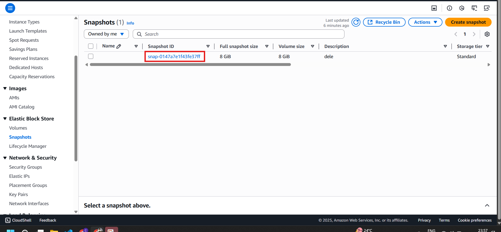
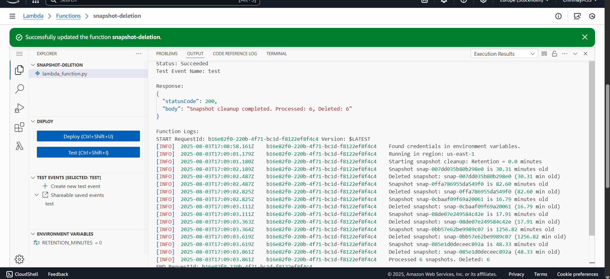
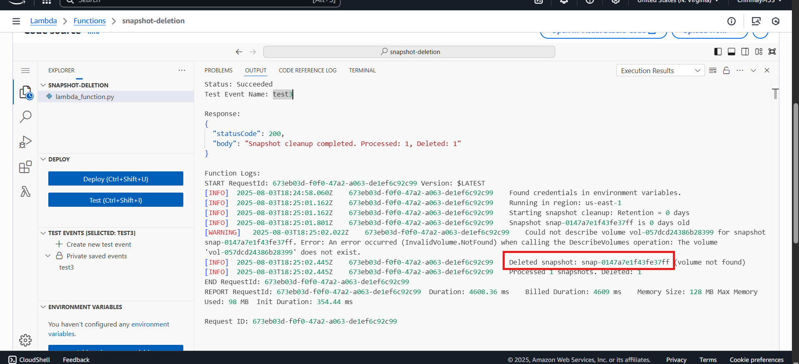

# AWS Lambda Function to Delete Old Snapshots

This project contains a **Python AWS Lambda script** that deletes **old EBS snapshots** in your AWS account to optimize costs.  
You can also modify it to **move snapshots to S3 Glacier** instead of deleting them.

---

## 📝 Function Logic

The Lambda script will **delete snapshots older than 30 days** if:

- The snapshot is **not attached** to any EBS volume.
- The snapshot is **attached** to an EBS volume, but that volume is not attached to any **running EC2 instance**.

The script will **keep snapshots** if:

- The snapshot is attached to an **EBS volume** that is currently attached to an **EC2 instance**.
- The snapshot is **less than 30 days old**.

---

## ⚙️ Technologies Used
- **AWS Lambda**
- **Boto3** (AWS SDK for Python)
- **AWS EC2**
- **AWS CloudWatch Events**
- **AWS IAM**

---

## 🚀 Usage Instructions

1. **Create a Lambda Function** in AWS Management Console.
2. Upload this Python script to the Lambda function.
3. Set the **retention period** in days (e.g., `30`).
4. Schedule the Lambda function using **AWS CloudWatch Events**.
5. Test the Lambda function by **invoking it manually**.
6. Ensure the Lambda function has **IAM permissions** to:
   - `ec2:DescribeSnapshots`
   - `ec2:DescribeVolumes`
   - `ec2:DeleteSnapshot`

---

## 📌 Alternative Deployment
You can also deploy the Lambda function using the **CloudFormation template** (`template.yaml`) included in the same folder.

---

## 📷 Output Screenshots

### Snapshots Present

### AWS Console Output

### Snapshot Deletion Output

